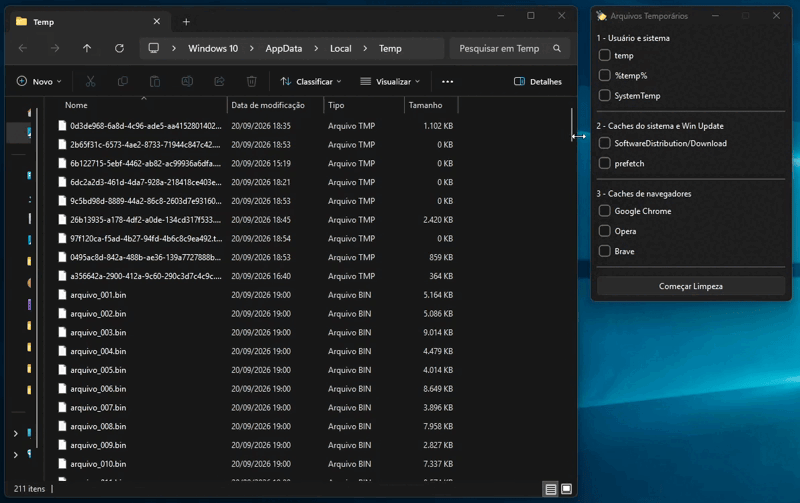

# Temporary Files Cleaner

**Aplicativo para limpeza de diretórios de arquivos temporários no Windows.**

(demonstração com arquivos gerados artificialmente)

Bibliotecas centrais usadas:
- Python `3.14.3`
- PySide6 `6.11.2` - GUI
- logging - Geração de arquivos log
- Pathlib, os, sys, ctypes - Operações de arquivos e requisição UAC

## Objetivo e funcionamento
Automatizar a limpeza de arquivos temporários criados pelo sistema operacional e armazenados em diretórios como `temp` e `%temp%`.

Fluxo de funcionamento:
1. Usuário seleciona os diretórios que quer limpar, marcando as caixas de seleção.
2. O programa separa os diretórios entre aqueles que precisam de privilégios de administrador e aqueles que não necessitam.
3. Os diretórios não-admin são limpos.
4. Caso o usuário tenha selecionado algum diretório que precisa de privilégios especiais, uma requisição é enviada.
5. Se aceita, o processo é relançado e as pastas admin são limpas.
6. Ao fim, uma caixa de mensagem mostra quantas pastas foram afetadas, informação caso algum diretório não possa ser acessado e quantos MiB foram liberados.

## Desafios
Alguns dos pontos que se provaram desafiadores durante o desenvolvimento do projeto são:
- **Ordem de limpeza dos diretórios**
    Um dos desafios menores que foi essencial ser resolvido para a aplicação funcionar como desejado. O problema: em um determinado estado do projeto, mesmo que o usuário recusasse a elevação para admin, o programa ainda tentava limpar as pastas.
    Solução: estruturar com mais cuidado o fluxo da função de limpeza e proteger que código indesejado seja executado usando `return` em pontos específicos.
- **Requisição de privilégios de administrador**
    Foi a minha primeira vez utilizando a biblioteca `ctypes` e acessando funções das DLLs do próprio Windows. A linha para relançar o processo com permissões de administrador `ShellExecuteW(None, "runas", ...)` se mostrou particularmente complexa de entender em um primeiro contato, considerando a quantidade de parâmetros (6).
- **Passagem de argumentos por linha de comando**
    Consideravelmente o ponto que mais me travou do projeto. O problema: ao relançar o processo como administrador, o usuário precisava remarcar as caixas de seleção e clicar novamente o botão de limpeza. O aplicativo não tinha nenhuma persistência de estado.
    Solução: passar as informações necessárias para o processo elevado por linha de comando e decidir o que fazer com base no que foi transmitido. Para isso, foi usada a biblioteca `argparse` para passar os argumentos ao código de requisição citado no item acima.

## Referências
Alguns dos materiais usados durante o desenvolvimento do projeto são:
- [PySide6 Crash Course: GUI Development in Python with Qt6](https://youtu.be/9_NGCpM2r7s?si=AH3kYiBoIClkWT_x) do canal [NeuralNine](https://www.youtube.com/@NeuralNine). Me apresentou os conceitos fundamentais da biblioteca que usei para desenvolver a GUI.
- [Python Logging EP 3: Rotating Log Handlers](https://youtu.be/s1aO_M_Vj3k?si=vNgrNjBG1BqmYhrr) do canal [James Clare](https://www.youtube.com/@pythonwithjames). Usado para implementar rotação de logs, evitando que o arquivo cresca indefinidamente.
- [How to request admin rights using python and run your python script with elevated admin rights](https://youtu.be/17gP3iCHwFg?si=SFi0oXNGvFbMi3w_) do canal [programming-matrix](https://www.youtube.com/@programming-matrix1125/featured). Ensina a fazer a requisição de privilégios de administrador.
- [Documentação oficial para PySide6.QtWidgets](https://doc.qt.io/qtforpython-6/PySide6/QtWidgets/index.html#module-PySide6.QtWidgets)
- [Como acessar variáveis do ambiente Windows: GeeksforGeeks.com](https://www.geeksforgeeks.org/python/access-environment-variable-values-in-python/)
- [Argumentos de linha de comando: GeeksforGeeks.com](https://www.geeksforgeeks.org/python/command-line-arguments-in-python/). Para passar argumentos entre o processo não-admin e o processo elevado usando a biblioteca `argparse`.
- Icone da aplicação: [Clean icons created by Magnific - Flaticon](https://www.flaticon.com/free-icons/clean)